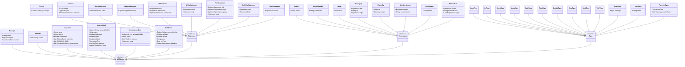

```mermaid
classDiagram
    %% Root Project (not an ASTNode)
    class Project {
      +List~Package~ packages
    }

    %% AST Node Base Class
    class ASTNode {
      <<abstract>>
    }

    %% Package & Imports
    class Package {
      +String name
      +Imports imports
      +List~ClassDecl~ classes
    }
    Package --|> ASTNode

    class Imports {
      +List~String~ names
    }
    Imports --|> ASTNode

    %% Class Declaration and Members
    class ClassDecl {
      +String name
      +String parent
      +Boolean isAbstract
      +List~MethodDecl~ methods
      +List~FieldDecl~ fields
      +List~ConstructorDecl~ constructors
    }
    ClassDecl --|> ASTNode

    class MethodDecl {
      +Option~String~ accessModifier
      +String name
      +Boolean isAbstract
      +Boolean static
      +Boolean isFinal
      +Type returnType
      +List~VarDecl~ params
      +Option~Statement~ body
    }
    MethodDecl --|> ASTNode

    class ConstructorDecl {
      +Option~String~ accessModifier
      +String name
      +List~VarDecl~ params
      +Statement body
    }
    ConstructorDecl --|> ASTNode

    class FieldDecl {
      +Option~String~ accessModifier
      +Boolean isStatic
      +Boolean isFinal
      +String name
      +Type varType
      +Option~Expression~ initializer
    }
    FieldDecl --|> ASTNode

    %% Statements Hierarchy (all extend ASTNode via Statement)
    class Statement {
      <<abstract>>
    }
    Statement --|> ASTNode

    class VarDecl {
      +String name
      +Type varType
      +Option~Expression~ initializer
    }
    VarDecl --|> Statement

    class BlockStatement {
      +List~Statement~ stmts
    }
    BlockStatement --|> Statement

    class ReturnStatement {
      +Option~Expression~ expr
    }
    ReturnStatement --|> Statement

    class IfStatement {
      +Expression cond
      +Statement thenBranch
      +Option~Statement~ elseBranch
    }
    IfStatement --|> Statement

    class WhileStatement {
      +Expression cond
      +Statement body
    }
    WhileStatement --|> Statement

    class ForStatement {
      +Option~Statement~ init
      +Option~Expression~ cond
      +Option~Expression~ update
      +Statement body
    }
    ForStatement --|> Statement

    class DoWhileStatement {
      +Expression cond
      +Statement body
    }
    DoWhileStatement --|> Statement

    class PrintStatement {
      +Expression toPrint
    }
    PrintStatement --|> Statement

    %% Expression Hierarchy (all extend ASTNode via Expression)
    class Expression {
      <<abstract>>
    }
    Expression --|> ASTNode

    class VarRef {
      +String name
    }
    VarRef --|> Expression

    class StaticClassRef {
      +String className
    }
    StaticClassRef --|> Expression

    class Literal {
      +Any value
    }
    Literal --|> Expression

    class BinaryOp {
      +Expression left
      +String op
      +Expression right
    }
    BinaryOp --|> Expression

    class UnaryOp {
      +String op
      +Expression expr
    }
    UnaryOp --|> Expression

    class MemberAccess {
      +Expression target
      +String memberName
    }
    MemberAccess --|> Expression

    class ThisAccess {
      +String name
    }
    ThisAccess --|> Expression

    class MethodCall {
      +Expression target
      +String methodName
      +List~Expression~ args
    }
    MethodCall --|> Expression

    %% Types Hierarchy
    class Type {
      <<abstract>>
    }
    Type --|> ASTNode

    class NoneType {
    }
    NoneType --|> Type

    class IntType {
    }
    IntType --|> Type

    class ShortType {
    }
    ShortType --|> Type

    class LongType {
    }
    LongType --|> Type

    class ByteType {
    }
    ByteType --|> Type

    class FloatType {
    }
    FloatType --|> Type

    class DoubleType {
    }
    DoubleType --|> Type

    class CharType {
    }
    CharType --|> Type

    class BoolType {
    }
    BoolType --|> Type

    class VoidType {
    }
    VoidType --|> Type

    class ArrayType {
      +Type baseType
    }
    ArrayType --|> Type

    class UserType {
      +String name
    }
    UserType --|> Type

    class FunctionType {
      +Type returnType
      +List~Type~ parameterTypes
    }
    FunctionType --|> Type
```